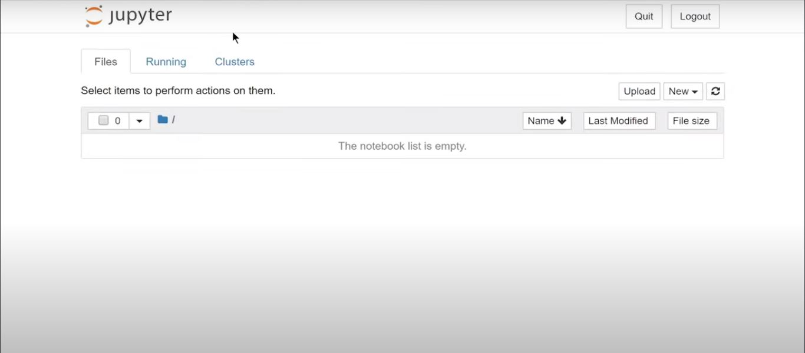

After you done installing Pandas install numpy:
```
pip install numpy
```

# Installation & Setup for jupyter:
  Install it after install numpy package from above command

  ```
pip install jupyter
```
to run jupyter in your browser, write:
```
jupyter notebook
```

<h2>You will be redirect here</h2>


